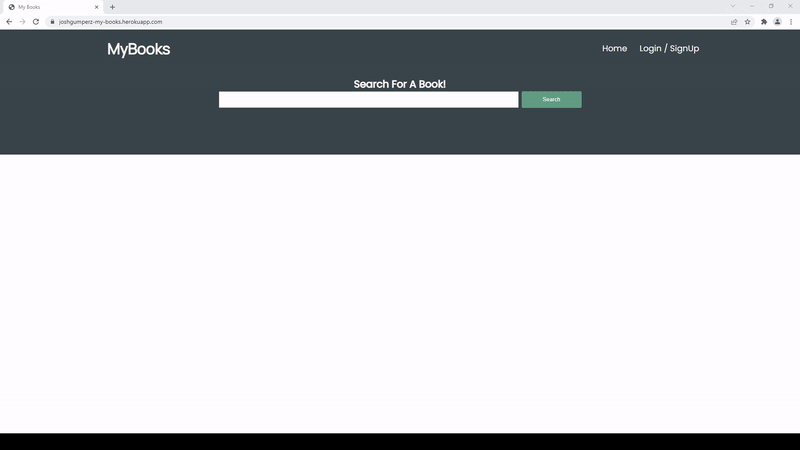

# MyBooks
MyBooks

MyBooks is a book database website. Complete with account creation, book search, and the ability to save a list of all your favorite books!

I've included a gif of what the site looks like. The site is also linked below so feel free to take a look.
Main features include:
- A search function that allows you to input a book title information on that book, including the author, the release date, cover photo, and description
- A save feature which gives the user the ability to save a list of all their favorite books.
- And account creation

### Prerequisites

In order to use the MyBooks deployed site, all you'll need is a device with internet connection, and a browser. 

But if you want to clone the repository and edit the files, you'll need to have mySQL and Node.js installed. 

## Getting Started

To view and edit the files you can clone the repo from github using the following command:

```
git clone git@github.com:JoshGumperz/MyBooks.git
```

After cloning the repo, mySQL, node and npm must be installed. Type
```
npm install
```
to install dependencies.

After doing that, create a .env file in the same directory as server.js with the following content
```
DB_USER=root
DB_PASSWORD=<your mySQL password>
DB_NAME=book_db
SECRET=<your session secret>
```

To run the server and compile the react app type:
```
npm run start
```

then go to localhost:3001 in your browser

## Site Picture


## Built With
* [Handlebars.js](https://handlebarsjs.com/)
* [CSS](https://developer.mozilla.org/en-US/docs/Web/CSS)
* [Javascript](https://developer.mozilla.org/en-US/docs/Web/JavaScript)
* [Node](https://nodejs.org/en/)
* [MySQL](https://www.mysql.com/)

## Deployed Link

* [See Live Site](https://my-books-1337.herokuapp.com/)


## Authors

**Josh Gumperz**

- [Link to Github](https://github.com/JoshGumperz)

**Eddie Yeung**
- [Link to Github](https://github.com/eycs0317)

**Cristina Tepelikian**
- [Link to Github](https://github.com/htepelikian)


## License

This project is licensed under the MIT License.