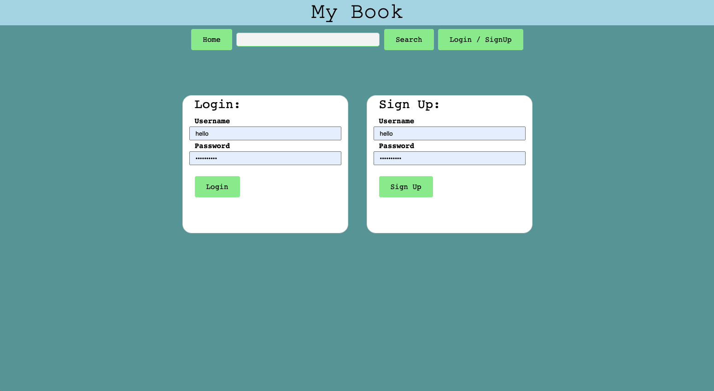

# MyBooks
MyBooks

MyBooks is a book database website. Complete with account creation, book search, and the ability to save a list of all your favorite books!

### Prerequisites

In order to use MyBooks, you'll need a device with internet connection, and a browser.

## Getting Started

I've included screenshots of what the site looks like. The site is also linked below so feel free to take a look.
Main features include:
- A search function that allows you to input a book title information on that book, including the author, the release date, cover photo, and description
- A save feature which gives the user the ability to save a list of all their favorite books.
- And account creation

Upon initially loading in to the site you will see a page that looks like this:

If you choose, you can hit the login/signup button to either login to an existing account or create a new account. In which case you will be presented with a page that looks like this:

After loggin in or signing up successfully, you will be presented with a popup message that looks like this:

Alternatively, if you failed to login or sign up correctly the pop up message will look like this:

After searching a book title you will be presented with a search results page containing all of the related search results.

From here you can click on any book in the list and get more information on that book.

If you choose, you can also add this book to your favorites list.

After clicking on the favorites nav button, you will be presented with a page containing all your favorite books.

## Built With
* [HTML](https://developer.mozilla.org/en-US/docs/Web/HTML)
* [CSS](https://developer.mozilla.org/en-US/docs/Web/CSS)
* [Javascript](https://developer.mozilla.org/en-US/docs/Web/JavaScript)
* [Node](https://nodejs.org/en/)
* [MySQL](https://www.mysql.com/)

## Deployed Link

* [See Live Site](https://mysterious-sands-50704.herokuapp.com/)

## Authors

**Josh Gumperz**

- [Link to Github](https://github.com/JoshGumperz)

**Eddie Yeung**
- [Link to Github](https://github.com/eycs0317)

**Cristina Tepelikian**
- [Link to Github](https://github.com/htepelikian)

## License

This project is licensed under the MIT License.